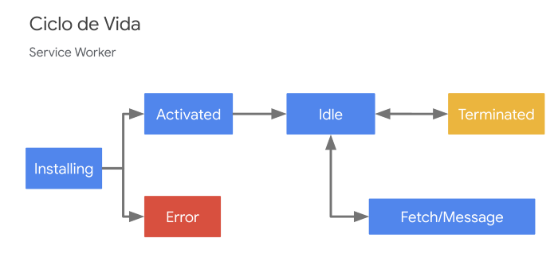

# service-worker-demo

* ¿Qué son los Service Worker?
* ¿Para qué sirven?
* Ejemplo práctico
  * Ciclo de vida
  * Código

[comment]: <> (VAPID_PUBLIC_KEY = BG6LCkD5xsL4IuD81gEqm9NLkTftXB8y1LX5P2qbtnBaMC9150BFJqKFboKq--t7SEP8TC0p6YTy-9nuIpsG6ps)
[comment]: <> (VAPID_PRIVATE_KEY = FqEXjM0fG93AKBebZCrygTGic2vHxXOHiH4nCfJlyCA)